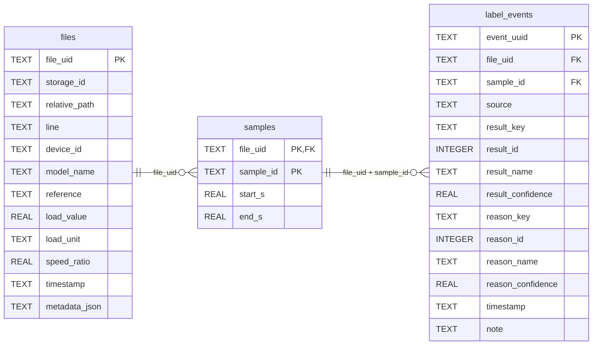

配置
基础预处理、频谱、mel频谱、小波分解算法
音频文件处理部分

数据库维护与业务


界面


后续的训练：单独给他们写一个操作界面，不共用

## 模型
### 原始数据模型

文件表：文件路径 + 工况数据
```json
{
  "file_uid": "8c2d8f4a-1234-4bcd-8abc-0123456789ab", // 文件稳定 ID，移动时不变
  
  "storage_id": "wuxi_raw", // 在配置中查找存储根目录
  "relative_path": "epump2/20260319/E-pump_001.tdms.zst", // 相对路径，根目录下一级
  
  "conditions": {
    "line": "epump2", "device_id": "daq_01", "model_name": "机型A", "reference": "reference_A", // 产线、设备和产品
    "load_value": 80, "load_unit": "%", "speed_ratio": 1.0, // 负载和转速比
    "timestamp": "2026-09-22T10:30:00+08:00" // 采集时间
  },
  
  "metadata": {}, // 其他文件属性
}
```

```
推荐文件存储结构：
```bash
存储配置：wuxi_raw → /Volumes/disk1/DatasetName/lineX

/Volumes/disk1/wuxi_raw/             ← wuxi_raw 数据库名称
└── epump2/                          ← 产线/类型
    └── 20260319/                    ← 文件夹/类别/reference等等
        └── E-pump_....tdms.zst      ← 原始文件
```

### 标签模型
包含一下信息：
```json
{
  "prototype": True / False,
  "samples": [
    {
      "sample_id": "up", // 文件内唯一
	  "sample_scope": {"start_s": 2.5, "end_s": 5.0},// 相对文件起点的秒数；
      "label_events": [
        {
          "event_uuid": "11111111-1111-4111-8111-111111111111", // 本次标注的唯一 ID
          "source": "employee", // 标注来源
          "result_key": "ok", "result_id": 0, "result_name": "正常", "result_confidence": 0.8, // 总体结果
          "reason_key": null, "reason_id": null, "reason_name": null, "reason_confidence": null, // 细分类别
          "timestamp": "2026-09-22T15:20:00+08:00", "note": "" // 标注时间和备注
        }
      ]
    },
    {
      "sample_id": "down",
      "sample_position": {"start_s": 2.5, "end_s": 5.0},
      "label_events": [] // 尚无标签
    }
  ]
}
```

### 连接


## 业务
数据库列表

数据维护
	导入数据
		填写工况，导入文件/文件夹：按照文件夹、按照文件更改
	更新数据工况
	更新数据路径

标签维护
	选择文件/文件夹标注、筛选工况标注、筛选标签标注
		选择来源、类型，进入标注
		怎么提供文件路径呢？
		怎么写入数据库呢？

数据面板
	筛选工况显示

数据库操作
	合并、拆分等等


标签面板
	按照来源、一致性、文件级别/样本级别叠加筛选，支持下拉

数据面板
	按照工况叠加筛选，支持下拉
	


模糊搜索 文件


标注业务
	专家确认：自动生成一条来源是专家的新标注

关于典型数据的任务

## 文件结构
```json
{
  "file_uid": "8c2d8f4a-1234-4bcd-8abc-0123456789ab", // 文件稳定 ID，移动时不变
  
  "storage_id": "wuxi_raw", // 在配置中查找存储根目录
  "relative_path": "epump2/20260319/E-pump_001.tdms.zst", // 相对路径
  
  "conditions": {
    "line": "epump2", "device_id": "daq_01", "model_name": "机型A", "reference": "reference_A", // 产线、设备和产品
    "load_value": 80, "load_unit": "%", "speed_ratio": 1.0, // 负载和转速比
    "timestamp": "2026-09-22T10:30:00+08:00" // 采集时间
  },
  
  "metadata": {}, // 其他文件属性
  
  "prototype": True / False,
  "samples": [
    {
      "sample_id": "up", // 文件内唯一
	  "sample_scope": {"start_s": 2.5, "end_s": 5.0},// 相对文件起点的秒数；
      "label_events": [
        {
          "event_uuid": "11111111-1111-4111-8111-111111111111", // 本次标注的唯一 ID
          "source": "employee", // 标注来源
          "result_key": "ok", "result_id": 0, "result_name": "正常", "result_confidence": 0.8, // 总体结果
          "reason_key": null, "reason_id": null, "reason_name": null, "reason_confidence": null, // 细分类别
          "timestamp": "2026-09-22T15:20:00+08:00", "note": "" // 标注时间和备注
        }
      ]
    },
    {
      "sample_id": "down",
      "sample_position": {"start_s": 2.5, "end_s": 5.0},
      "label_events": [] // 尚无标签
    }
  ]
}
```




## 数据库设计一般思路
实体
主键和外键